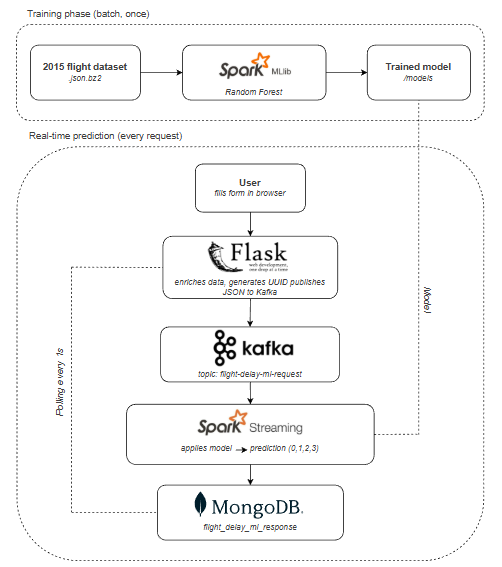

# Flight Delay Prediction - Big Data Practice I

A real-time application that predicts flight delays using a Random Forest model trained on 2015 US flight data. Users submit flight details through a Flask web interface, which sends the request via Kafka to a Spark Streaming job that applies the model and stores the prediction in MongoDB, which the web interface polls to display the result.

  
  
<em>Architecture diagram created with <a href="https://app.diagrams.net/">Draw.io</a></em>

## Based on
This project is based on [practica_creativa](https://github.com/Big-Data-ETSIT/practica_creativa) 
from Big-Data-ETSIT, which is itself based on 
[Agile Data Science 2.0](https://github.com/rjurney/Agile_Data_Code_2) 
by Russell Jurney.

## Prerequisites

You may have the following tools installed before running the project:

- Java 17 (via SDKMAN)
- Scala 2.12.10 (via SDKMAN)
- Apache Spark 3.5.3 (via SDKMAN)
- Apache Kafka 2.12-3.9.0
- MongoDB 7.0
- Python 3.12
